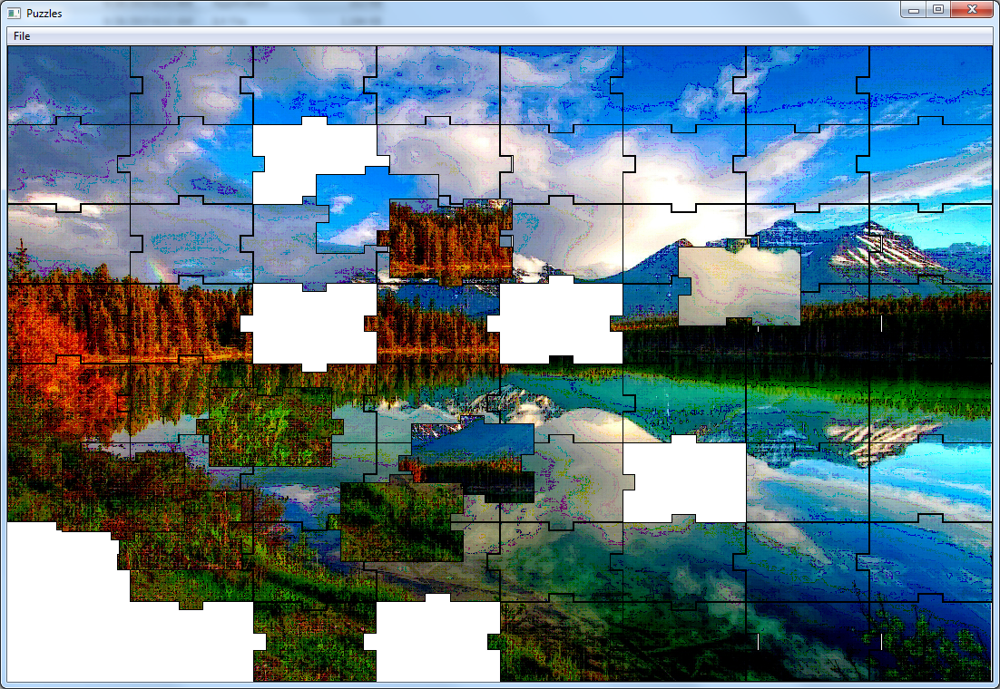

# PuzzleMaker

This is a backup of an old repository which will likely not be maintained in the future.

This proejcts automatically creates puzzles from an input image.

## Sample Image

## TO DOS:

- Disperse puzzles at beginning
- Allow Rotation
- More Variation on Bumps
